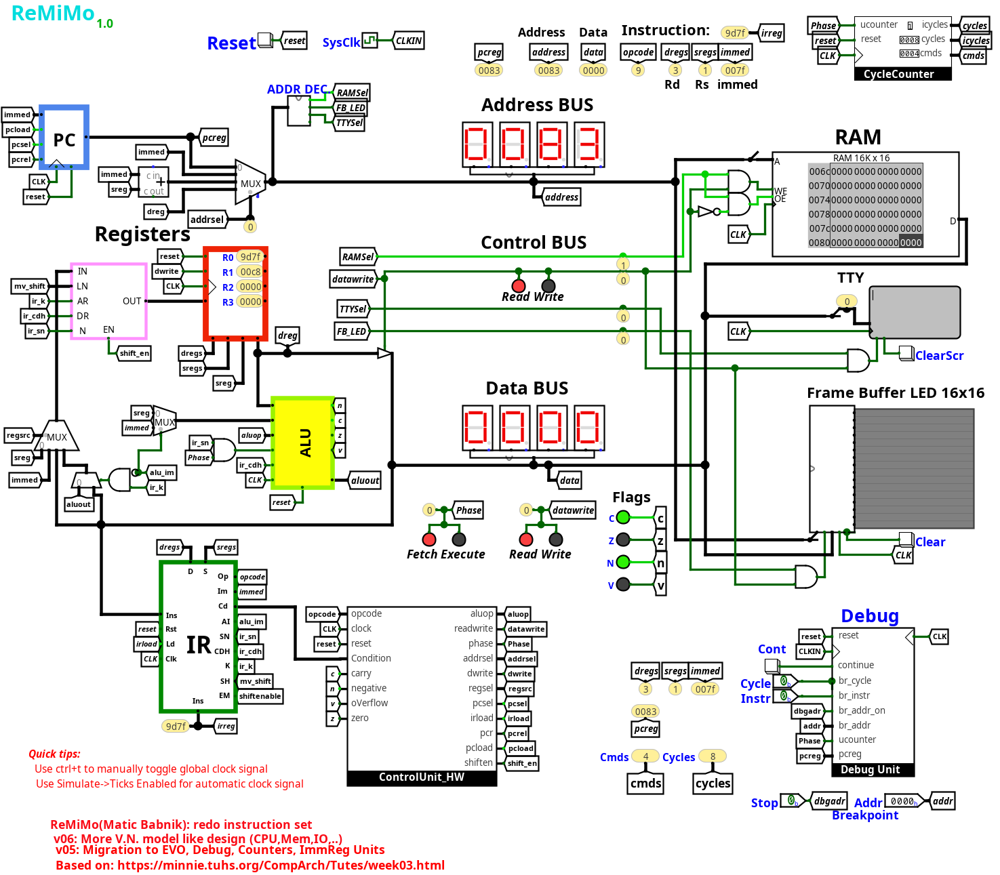

# ReMiMo

A 16-bit hardwired CPU built in Logisim Evolution.

It's based on [MiniMiMo](https://github.com/LAPSyLAB/RALab-STM32H7/tree/main/MiniMiMo_HW_CPE_Model), which is based on [Warren Toomey's "An Example Hardwired CPU"](https://tuhs.org/CompArch/Tutes/week03.html).

## CPU documentation

-   [Architecture](docs/arch.md)
-   [Instruction table](docs/ReMiMo.ods)

## MImo Assembler

The most scuffed assembler ever!? To assemble a program run:
`node mia.js source.mia output.ram`

For example programs see the `mia/test` directory.

